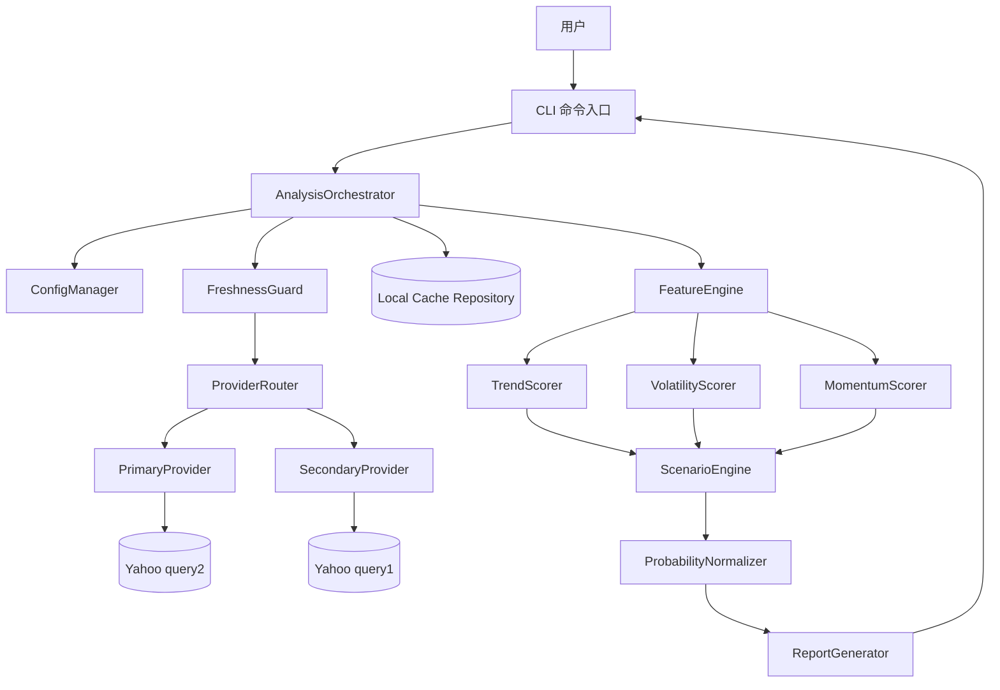
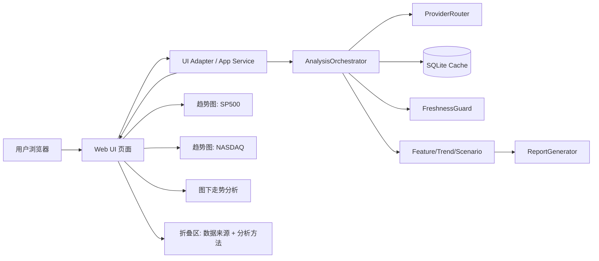

# 指数分析工具设计文档（S&P 500 + Nasdaq Composite）

## 1. 核心目标
- 在每次分析时优先获取最新可用日线数据，避免仅基于历史离线数据。
- 覆盖两个指数：S&P 500 与 Nasdaq Composite，并支持单独或对比分析。
- 输出短期（1-5 交易日）、中期（1-4 周）、长期（1-3 个月）三档趋势概率。
- 结论可解释、中文易读，适合非专业用户快速理解。
- 首版以本地 CLI 交付，结构可扩展到 API/Web。

## 2. 设计原则
- 最新数据优先：每次运行先拉取，再分析，再输出。
- 可靠性优先：主备数据源 + 新鲜度校验 + 故障回退。
- 可解释优先：采用统计/规则模型，避免首版黑盒模型。
- 最小可运行优先：先完成端到端闭环，再扩展高级能力。
- 低依赖复杂度：仅引入必要依赖，降低维护成本。

## 3. 总体架构
系统采用“CLI + UI + 应用编排层 + 数据层 + 分析层 + 报告层”的分层架构。



### 3.1 UI 增量架构（2026-04-01）
在现有分层架构上新增 `UI 展示层`，并复用同一套数据与分析服务，保证“图表与结论一致”。



## 4. 关键流程设计
### 4.1 单次分析流程
1. CLI 读取参数（指数、周期、时区、输出模式）。
2. 编排层触发数据更新：先主源，失败后备用源。
3. 执行新鲜度校验：判断是否达到“最新可用交易日”。
4. 将成功拉取数据写入本地缓存，并记录更新时间与来源。
5. 分析层计算趋势、波动、动量特征，生成三档时间窗口评分。
6. 场景引擎输出上涨/震荡/下跌原始分值。
7. 概率归一化为 0-100%，保证总和 100%（允许微小舍入误差）。
8. 报告层生成中文结论 + 风险提示 + 数据状态说明。

### 4.2 故障回退流程
1. 主数据源请求失败或返回异常字段。
2. 自动切换备用数据源重试。
3. 若仍失败，则回退最近一次成功缓存，并标注“时效受影响”。
4. 若无缓存，则终止并输出明确错误与建议。

## 5. 模块划分
| 模块 | 主要职责 | 输入 | 输出 |
|---|---|---|---|
| `cli` | 参数解析、触发分析、终端展示 | 命令参数 | 控制台报告 |
| `app/orchestrator` | 统一编排流程与错误处理 | CLI 请求 | 完整分析结果对象 |
| `infra/providers` | 对接主备行情源 | 指数代码、时间范围 | 标准化 OHLCV 数据 |
| `infra/repository` | 本地缓存与拉取日志存储 | 标准化行情数据 | 可查询历史与元数据 |
| `domain/features` | 计算趋势/波动/动量特征 | 历史 + 最新数据 | 特征向量 |
| `domain/scenario` | 生成场景评分与概率 | 特征向量 | 三分类展示概率（上涨/不确定/下跌） |
| `domain/probability/*` | 分位数建模、OOF 校准、概率约束、回测评估 | OHLCV 特征矩阵 + 标签 | 更稳健的短/中/长期三分类概率 |
| `domain/reporting` | 中文结论与风险提示生成 | 概率 + 信号 + 元数据 | 用户可读报告 |
| `infra/config` | 环境变量与配置管理 | `.env` / 命令参数 | 运行时配置对象 |
| `infra/logging` | 结构化日志 | 事件与异常 | 本地日志记录 |

### 5.1 UI 模块划分（新增）
| 模块 | 主要职责 | 输入 | 输出 |
|---|---|---|---|
| `ui/page` | 组织页面布局（趋势图、分析区、折叠区） | 视图模型 | 可视化页面 |
| `ui/charts` | 渲染指数趋势图 | 历史价格序列 | SP500/NASDAQ 折线图 |
| `ui/analysis_panel` | 展示图下走势分析文本 | 分析结论文本 | 中文结论区 |
| `ui/disclosure` | 折叠展示数据来源与分析方法 | provider/meta/method 文本 | 可展开详情区 |
| `ui/view_model` | 将领域结果映射为 UI 展示对象 | `AnalysisResult` | UI DTO |

## 6. 组件设计
### 6.1 核心组件
- `AnalysisOrchestrator`
  - 职责：串联“拉数 -> 校验 -> 分析 -> 报告”。
  - 约束：不得跳过新鲜度检查。
- `ProviderRouter`
  - 职责：主备数据源切换、失败重试、统一异常。
  - 约束：输出统一数据模型，屏蔽上游差异。
- `FreshnessGuard`
  - 职责：校验最后交易日、更新时间、时区一致性。
  - 约束：校验失败时必须在报告中显式告警。
- `ScenarioEngine`
  - 职责：将指标信号映射到上涨/震荡/下跌分值。
  - 约束：模型规则可解释，可打印关键因子贡献。
- `ReportGenerator`
  - 职责：生成中文短结论（3-8 句）与风险声明。
  - 约束：明确“模型估计，不构成投资建议”。

### 6.3 UI 组件设计（新增）
- `TrendChartCard`
  - 职责：展示单个指数趋势图（标题 + 时间范围 + 数据点 + 图下 PE）。
  - 约束：图表时间范围与分析结论必须同源同时间戳。
- `HeaderMetaBadge`
  - 职责：在页面右上角展示全局市场状态（当前为 `VIX`）。
  - 约束：若实时拉取失败，按 `Yahoo -> AlphaVantage(可选) -> FRED -> 缓存 -> seed(本地/内置)` 逐级回退；仍失败则显示 `N/A` 并不阻断主页面渲染。
- `TrendAnalysisBlock`
  - 职责：在趋势图下展示该指数走势分析文本。
  - 约束：文案简洁，避免与图表数据冲突。
- `DetailDisclosure`
  - 职责：折叠展示补充信息。
  - 默认状态：收起。
  - 展开内容：
    - 数据来源（provider、更新时间、回退状态）；
    - 分析方法（特征项、评分逻辑、概率归一化简述）。

### 6.2 关键接口（逻辑设计）
```python
class MarketDataProvider(Protocol):
    name: str
    def fetch_daily(self, symbol: str, start: date, end: date) -> list[Candle]: ...

class Repository(Protocol):
    def save_prices(self, symbol: str, candles: list[Candle], source: str) -> None: ...
    def load_prices(self, symbol: str, lookback_days: int) -> list[Candle]: ...
    def last_success(self, symbol: str) -> DataSnapshotMeta | None: ...
```

## 7. 数据结构设计
### 7.1 标准行情结构 `Candle`
- `symbol: str`
- `trade_date: date`
- `open: float`
- `high: float`
- `low: float`
- `close: float`
- `volume: float | None`
- `source: str`
- `fetched_at: datetime`

### 7.2 分析结果结构 `AnalysisResult`
- `symbol`
- `as_of`
- `trend_signals`（短/中/长）
- `scenario_probs`
- `confidence`
- `data_status`（source、last_trade_date、fetched_at、is_fresh）
- `summary_zh`
- `risk_notes`

### 7.3 概率结构 `ScenarioProbs`
- `horizon: short | mid | long`
- `uptrend_pct`
- `sideways_pct`
- `downtrend_pct`

## 8. 建议目录结构
```text
IndexTrack/
  design.md
  requirement.md
  pyproject.toml
  uv.lock
  .env.example
  src/indextrack/
    cli.py
    app/
      orchestrator.py
      models.py
    domain/
      features.py
      trend.py
      scenario.py
      report.py
    infra/
      config.py
      logging.py
      providers/
        base.py
        primary.py
        secondary.py
      repository/
        sqlite_repo.py
  tests/
    test_orchestrator.py
    test_scenario.py
    test_provider_fallback.py
```

UI 增量建议目录：
```text
IndexTrack/
  src/indextrack/
    ui/
      page.py
      charts.py
      analysis_panel.py
      disclosure.py
      view_model.py
  tests/
    test_ui_view_model.py
    test_ui_disclosure.py
```

## 9. 数据源与可靠性设计
- 数据源采用“主源 + 备用源”适配器架构，支持后续替换供应商。
- 当前实现（2026-04-01）：
  - 主源：Yahoo Finance `query2` chart 接口（免 API Key）。
  - 备用源：Yahoo Finance `query1` chart 接口（免 API Key）。
  - 当主备都失败时：自动回退本地 SQLite 缓存并输出告警。
- 每次分析前执行新鲜度校验：
  - 是否更新到最新可用交易日；
  - 是否存在异常缺口或重复日期；
  - 更新时间是否超过阈值。
- 新鲜度交易日规则（当前实现）：
  - 使用 NYSE 常规休市日历（含观察日 + Good Friday 等）。
  - 新鲜度滞后按“交易日差”计算，不按自然日差计算。
- 回退机制：
  - 主源失败 -> 备用源；
  - 双源失败 -> 使用最近成功缓存并告警；
  - 无缓存 -> 返回失败并提示修复建议。
- 可靠性观测：
  - 记录数据源名称、请求耗时、成功/失败、返回行数、最后交易日。

## 10. 概率模型设计（可解释）
### 10.1 Horizon 设定
- `short=5`、`mid=20`、`long=60` 个交易日。
- 每个 horizon 输出三分类概率：`up / flat / down`。

### 10.2 标签定义（无泄露）
- `future_return_h = close.shift(-h) / close - 1`
- `hist_vol_20 = daily_return.rolling(20).std()`
- `threshold_up_h = k_h * hist_vol_20 * sqrt(h)`
- `threshold_down_h = -threshold_up_h`
- 初始参数：
  - `k_5=0.35`
  - `k_20=0.50`
  - `k_60` 采用 profile 化默认：

## 16. 阶段收口与默认策略（2026-04）
- `long` 路线收口：保持 `raw-only`（`mid/long` 默认不启用 calibrator），`baseline` 保留。
- `short guard` 路线收口：`v1/v2` 诊断后均未形成稳定收益，默认保持关闭，不再作为主线优化方向。
- `short calibrator` 默认升级为 `A1 simpler calibrator`：
  - short 保持 `conservative` 模式；
  - 默认 `calibrator_temperature` 提升至 `1.60`，用于降低过度翻盘风险并提升概率质量。
- 本阶段不再继续推进 `A2/A3`、display 约束微调与 short guard 阈值微调，后续优化聚焦 calibrator 本体与 raw 概率层。
    - `baseline`: `0.65`
    - `optimized_v1`: `0.60`
- 标签：
  - `up`: `future_return_h > threshold_up_h`
  - `down`: `future_return_h < threshold_down_h`
  - `flat`: 其余

### 10.3 特征集（当前实现）
- 收益：1/3/5/10/20/60 日收益
- 均线偏离：`close/MA5-1`、`close/MA10-1`、`close/MA20-1`、`close/MA60-1`
- 均线价差：`MA5/MA20-1`、`MA20/MA60-1`
- 波动：rolling std 5/10/20/60
- 回撤：rolling max drawdown 20/60
- `RSI14`
- `MACD line/signal/hist`
- `Bollinger zscore`
- `volume zscore 20`
- rolling high/low 相对位置 20/60

### 10.4 训练与 OOF 校准
- 每个 horizon 训练三个分位数回归器：`q10/q50/q90`。
- 使用严格时间序列 expanding split 生成 OOF。
- 用 OOF `raw probs` 的 log 特征训练多分类 softmax calibrator。
- 再用全量训练集重训正式分位数模型用于推理。
- 新增 horizon 级校准策略（2026-04-01 更新）：
  - `short` 默认启用 calibrator（`conservative`）。
  - `mid` 默认关闭 calibrator（`none`）。
  - `long` 默认关闭 calibrator（`none`）。
  - 支持 `recent_oof_ratio` 仅使用近期 OOF 样本训练 calibrator，用于 regime shift 实验。

### 10.5 概率映射与收缩
- `mu=q50`。
- `sigma=max((q90-q10)/2.5632, sigma_floor_h)`。
- 假设收益近似正态，计算 `p_down_raw / p_flat_raw / p_up_raw`。
- OOF calibrator 输出 `calibrated probs` 后做收缩：
  - `final = lambda_h * calibrated + (1-lambda_h) * base_probs`
  - 默认 `optimized_v1`: `lambda_5=0.80`、`lambda_20=1.00`、`lambda_60=1.00`
  - `baseline`:
    - `lambda_5=0.80`
    - `lambda_20=0.75`
    - `lambda_60=0.70`
  - 解释：`mid` 与 `long` 默认都走 raw-only（关闭 calibration 与 shrinkage）。
- 校准保守化（新增）：
  - 支持 `calibrator mode = softmax / conservative / none`
  - 支持 horizon 级覆盖：`mode_5 / mode_20 / mode_60`
  - 支持 horizon 级 `calibration_blend` 与 `max_calibration_shift`，用于限制 raw -> calibrated 的过度翻转。
- base prior 调整（新增）：
  - 支持 horizon 级 `base_prob_recent_weight` 与 `base_prob_recent_window`；
  - 可在 label distribution 漂移时，对近期分布进行部分混合以缓解 prior 失配。
- 默认单边上限 `0.72`，仅在极端高波动 regime 放宽。

### 10.6 评估输出
- `multiclass log loss`
- `multiclass brier score`
- `accuracy`
- `confusion matrix`
- `calibration report`（`prob_down/prob_up` 分桶）
- regime 分层评估（`low_vol/mid_vol/high_vol`）

### 10.7 诊断与消融（新增）
- 诊断链路：
  - 每个 horizon 输出 `train/oof label distribution`、`raw/calibrated/final metrics`、`chain shift`、`q10/q50/q90/sigma`、`threshold stats`。
- CLI 调试参数：
  - `--prob-debug`：打印 horizon 级完整调试信息。
  - `--prob-ablation`：输出 horizon-specific 消融实验表格与每个 horizon 推荐方案。
- 消融维度：
  - `short_pipeline`（raw / raw+calibration / full_chain）
  - `mid_pipeline`（raw / raw+shrinkage / raw+current calibration / raw+conservative calibration）
  - `long_pipeline`（raw / raw+mild shrinkage / raw+current calibration / raw+conservative calibration）
  - `long_threshold`（current / slightly narrower / narrower）
  - `long_sigma_floor`（current / higher / lower）
  - `long_lambda`（current / weaker / stronger）
  - `calibration_recent_window`（mid/long 近期窗口校准）
  - `prior_adjustment`（long 近期先验混合）
- A/B 配置：
  - `INDEXTRACK_PROB_PROFILE=baseline|optimized_v1`
  - 保留旧参数档位，新增优化档位，便于回测对比。

## 11. 依赖管理方案
### 11.1 候选工具对比
- `pip + venv`
  - 优点：原生、学习成本低。
  - 缺点：锁定与跨环境复现能力弱，团队协作成本高。
- `Poetry`
  - 优点：功能完整、生态成熟。
  - 缺点：解析与安装速度通常慢于新一代工具。
- `uv`（推荐）
  - 优点：速度快、锁文件稳定、兼容 `pyproject.toml`、可统一管理虚拟环境与依赖。
  - 缺点：团队需熟悉 `uv` 命令体系。

### 11.2 最优选择
- 选择：`uv` 作为依赖与环境管理工具。
- 选择理由：
  - 更快的安装/同步速度，适合频繁迭代。
  - 锁文件 `uv.lock` 便于结果可复现。
  - 与现代 Python 项目结构兼容，适合 CLI 项目。

### 11.3 依赖分层（建议最小集合）
- 运行时依赖：
  - Python 标准库（`argparse`、`urllib`、`sqlite3`、`zoneinfo` 等）。
  - `numpy`（概率模型与特征矩阵计算）。
- 开发依赖：
  - 当前实现使用 Python 标准库 `unittest` 做测试。
  - 后续可选引入 `pytest`/`ruff`，但非 MVP 必需。

### 11.4 版本与锁定策略
- 所有依赖通过 `uv add` 维护到 `pyproject.toml`。
- 每次变更依赖后更新并提交 `uv.lock`。
- CI 使用 `uv sync --frozen`，保证与本地一致。

## 12. 可测试性与验收映射
- FR-1 / FR-1.1：`test_provider_fallback.py` 验证主备切换与新鲜度告警。
- FR-2 / FR-3：`test_scenario.py` 验证三档概率输出范围与总和。
- FR-2 / FR-3（量化模型）：`test_probability_model.py` 验证 no-leakage、概率归一化、单调性修正、校准回测链路。
- FR-4：`test_report_zh.py` 验证中文结论长度与关键字段。
- NFR-1（新鲜度）：`test_freshness.py` 验证节假日与观察日场景下的交易日判断。
- NFR-1：端到端测试验证输出包含更新时间与数据源信息。
- FR-7（UI 趋势图）：`test_ui_view_model.py` 验证图表数据与分析结果时间一致。
- FR-8（折叠区）：`test_ui_disclosure.py` 验证默认收起及展开内容完整性。

## 13. 实施里程碑（MVP）
1. 打通 CLI -> 拉数 -> 输出原始数据状态。
2. 接入分析引擎与展示层概率输出（用户可见：上涨/不确定/下跌）。
3. 加入中文报告生成与风险提示。
4. 完成主备数据源回退和缓存机制。
5. 补齐测试与日志，达到 requirement 的 DoD。

## 14. 设计修改记录（Implementation Changelog）
### 2026-04-01（与代码实现对齐）
- 数据源方案调整：
  - 从“备用源需 API Key”的方案调整为“主备均免 API Key”。
  - 主备分别落地为 Yahoo `query2`（主）与 Yahoo `query1`（备）。
- 新鲜度策略升级：
  - 从“仅工作日近似”升级为“NYSE 常规休市日历 + 交易日差”。
  - 新增节假日相关单元测试覆盖。
- 依赖策略落地：
  - MVP 实现阶段采用“标准库优先”，未引入强依赖第三方计算库。
  - 依赖管理工具保留为 `uv`，用于环境与锁文件管理。
- 测试覆盖更新：
  - 新增 `test_freshness.py`，并将 `test_report_zh.py` 从“后续添加”改为“已实现”。

### 2026-04-01（新增 UI 需求设计补充）
- 新增 UI 展示层设计：
  - 页面展示 SP500 与 NASDAQ 趋势图；
  - 趋势图下展示对应走势分析。
- 新增折叠交互设计：
  - 默认收起；
  - 展开后显示数据来源与分析方法。
- 新增 UI 模块、组件与测试映射建议，保持与 CLI 共用分析编排层。

### 2026-04-01（UI 实现对齐）
- 已实现轻量本地 UI 服务（标准库 HTTP Server）：
  - 页面包含 SP500 与 NASDAQ 双趋势图；
  - 每个图下方展示走势分析；
  - 折叠区默认收起，展开后展示数据来源与分析方法。
- 已实现 UI 周期切换能力：
  - 通过查询参数 `period=1M|3M|6M|1Y` 切换趋势图窗口。
- 已补充 UI 自动化测试：
  - `test_ui_view_model.py`（图文数据映射）；
  - `test_ui_disclosure.py`（折叠与页面结构）。

### 2026-04-01（实现阶段稳定性补齐）
- 已增强 CLI 输入与运行前校验：
  - 非法 `period` 参数不再抛栈，改为返回友好错误与修复建议；
  - 非法时区参数（`timezone`）给出可执行提示并以退出码 `1` 结束；
  - 配置加载异常（环境变量格式问题）统一走友好错误输出。
- 已修复日志重配置句柄泄漏问题：
  - `setup_logging` 在重配时先移除并关闭旧 handler，避免 `FileHandler` 资源泄漏。
- 已补充稳定性测试：
  - `test_cli_errors.py`（非法周期/时区）；
  - `test_logging_setup.py`（日志重配关闭旧句柄）。

### 2026-04-01（概率展示口径修订）
- 三分类仍为主模型主链路（训练/评估/回测不变）。
- 用户展示层调整为“上涨 / 不确定 / 下跌”：
  - `flat` 作为不确定区核心来源；
  - 二分类方向仅作为辅助展示，不直接替代三分类主模型。
- 展示层新增保护规则：
  - 方向概率默认上限 `display_prob_cap=0.90`（可配置）；
  - 触发上限压缩时写入 warning；
  - `mid/long` 出现相反且极端方向时触发跨 horizon 降置信；
  - regime shift 明显时自动压缩方向置信度并提升 uncertain。
- 新增独立二分类展示校准链路（与三分类校准解耦）：
  - 每个 horizon 输出 binary `raw/calibrated/final` 指标；
  - `mid/long` 若 binary calibration 劣化，则自动禁用校准器（回退 raw）。

### 2026-04-01（量化概率模型升级）
- 新增 `quantile` 模型链路（现已统一为单模型运行）：
  - 新模块：`feature_engineering.py`、`label_builder.py`、`quantile_model.py`、`probability_mapper.py`、`calibrator.py`、`evaluator.py`、`model.py`。
  - 新接口：`MarketProbabilityModel.fit / predict_proba / predict / backtest`。
- 训练方式升级：
  - 三 horizon（5/20/60）分位数回归 + 时间序列 OOF + 多分类概率校准。
- 输出约束升级：
  - 概率收缩、单边上限、极端 regime 放宽、confidence 输出。
- 前端展示升级：
  - 图下新增 `raw vs calibrated`、`horizon threshold`、`current regime`、`confidence`。

### 2026-04-01（quantile 长期稳定性优化）
- 针对 long horizon 新增“可观测 + 可消融”能力：
  - `backtest` 增加 diagnostics：标签分布、raw/cal/final 指标、confusion matrix、reliability bins、q10/q50/q90/sigma/threshold 统计。
  - CLI 新增 `--prob-debug` 与 `--prob-ablation`。
- 校准链路新增保守化约束：
  - 新增 `calibrator mode`（`softmax/conservative/none`）；
  - 新增 `calibration_blend_h` 与 `max_calibration_shift_h`；
  - 限制 raw -> calibrated 的过度翻转。
- 参数 profile 化：
  - 新增 `INDEXTRACK_PROB_PROFILE=baseline|optimized_v1`；
  - 保留 baseline 旧参数；
  - `optimized_v1` 默认采用 horizon-specific 策略（`short=full chain`、`mid=raw only`、`long=raw only`），关键参数为 `k_60=0.60`、`lambda_20=1.00`、`lambda_60=1.00`。

### 2026-04-01（quantile 调试与实验增强）
- 调试输出增强：
  - `--prob-debug` 新增 `train` 与 `oof_valid` 标签分布及对应样本数，便于直接判别 long 标签稀疏问题。
- 消融对比增强（horizon-specific）：
  - short：`raw / raw+calibration / full_chain`；
  - mid：`raw / raw+shrinkage / raw+current calibration / raw+conservative calibration`；
  - long：`raw / raw+mild shrinkage / raw+current calibration / raw+conservative calibration`；
  - 追加 `long_threshold`、`long_lambda`、`calibration_recent_window`、`prior_adjustment` 实验组。

### 2026-04-03（display pipeline 稳健性修订）
- 目标：避免 `long` 在 `raw_uncertain` 已较高时被展示层继续过度推高。
- 新增 horizon-specific 展示层参数：
  - `display_regime_shift_uncertain_boost_{5,20,60}`
  - `display_high_vol_uncertain_boost_{5,20,60}`
  - `display_max_total_uncertain_boost_{5,20,60}`
  - `display_uncertain_ceiling_{5,20,60}`（默认 long=0.75）
- 新增 raw-aware boost 衰减逻辑：
  - `raw_uncertain >= 0.65` 开始衰减；
  - `raw_uncertain >= 0.75` 近似停用额外 boost。
- 展示链路新增中间阶段导出：
  - `post_shrink_probs`
  - `post_uncertainty_boost_probs`
  - 并输出 `regime_shift_boost_delta/high_vol_boost_delta/total_uncertain_boost_delta/uncertain_ceiling_applied`。

### 2026-04-03（模型层前移 + 轻展示护栏）
- 概率主链路升级为“多分位数分段分布映射”：
  - 默认量化点扩展为 `0.05/0.10/0.15/0.25/0.50/0.75/0.85/0.90/0.95`；
  - 从分位点插值近似条件分布，直接计算 `P(up/down/uncertain)`；
  - 减少“仅用 q10/q50/q90 拟合高斯分布”的结构性偏差。
- 标签升级为“状态条件化阈值”：
  - 在 `k_h * vol * sqrt(h)` 基础上叠加 regime 因子（波动比、趋势强度、回撤深度）；
  - 缓解高波动期 flat（不确定）标签过多导致的单一保守偏置。
- shrinkage 升级为“按样本动态 lambda(x)”：
  - 依据 `top1-top2 margin`、uncertain 比例、`|mu|/sigma` 动态调整收缩强度；
  - 再叠加 regime shift 惩罚，减少固定 `lambda_h` 的“一刀切”副作用。
- 展示层回退为“文案保护器”：
  - 默认关闭展示层二分类校准器（`display_use_binary_calibrator=false`）；
  - 保留轻量 cap/告警，限制单次 uncertain 提升，且默认不允许改变 top1 排序。
- 诊断导出与主链路对齐：
  - 导出脚本同步使用多分位数映射与动态收缩接口；
  - 保持 `raw/cal/final + post_shrink/post_uncertainty_boost` 可追踪口径。
- 新增模型体检与校准诊断字段：
  - `recent_label_distribution`（近端窗口标签分布）；
  - `label_distribution_by_regime`（按 regime 分层标签占比）；
  - `threshold_uncertain_bins`（threshold 与 uncertain 占比关系）；
  - `calibration_flip_summary`（raw->cal top1 翻转率、翻转后 logloss/brier 改善率、强方向被打回 uncertain 比例）。
- headline 文案升级为五档：
  - `明确看多 / 偏多但置信一般 / 中性不确定 / 偏空但置信一般 / 明确看空`；
  - 保留 `internal_state` 与 `display_label` 分层，避免“概率结构与标题文案不一致”。
